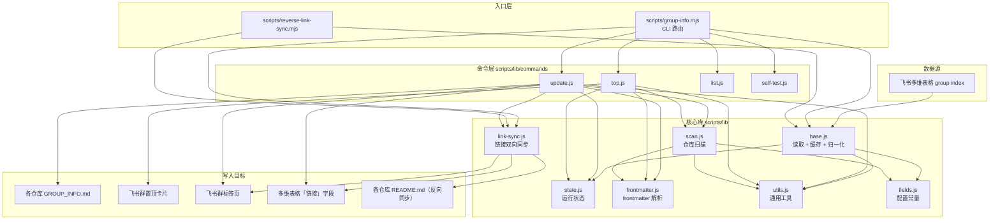

# Code Wiki — group-index

> 飞书多维表格驱动的项目索引与群信息管理仓库。
> 本文档由源码静态分析生成，覆盖架构、模块职责、关键函数、数据模型、依赖关系与运行方式。

---

## 1. 项目概述

### 1.1 定位

`group-index` 是一个**项目入口中枢**：用一张飞书多维表格 `group index` 管理所有个人项目的「人脑字段」（定位、优先级、链接、工作流、待办、备注），并派生出：

- 每个仓库内的 `GROUP_INFO.md`（群 Agent 上下文文档）；
- 飞书群的置顶信息卡片；
- 群标签页（chat tabs）的链接集合。

### 1.2 核心原则

| 原则 | 说明 |
|------|------|
| **人工字段以多维表格为准** | 定位、优先级、工作流、待办、备注只在多维表格维护，脚本不发明。 |
| **机器字段以仓库扫描为准** | Skill、数据源等可从代码/文档稳定读取的信息由扫描得到。 |
| **零依赖纯 Node.js** | 不引入任何 npm 依赖、构建工具、JS 框架或后端服务，仅用 Node 标准库 + 外部 `lark-cli`。 |
| **state.json 只存运行状态** | 不保存人工判断字段。 |
| **dry-run 优先** | 涉及飞书写入、群消息、批量更新时先跑 dry-run。 |

### 1.3 主要调用方

- 飞书群 *Group Index* 中的 Codex 小助手；
- `scripts/group-info.mjs`（唯一执行入口）；
- `scripts/reverse-link-sync.mjs`（独立的反向链接同步脚本）。

---

## 2. 技术栈与约束

- **运行时**：Node.js（ESM，`.mjs` / `.js`，`import` 语法）。
- **外部依赖**：`lark-cli`（飞书 CLI，通过 `child_process.spawnSync` 同步调用），需在 `PATH` 中可用且已完成鉴权。
- **飞书数据源**：多维表格 `group index`
  - base token：`AxMAbMTKOahp74sDuhqcERnrnph`
  - table id：`tblwQkPtmNOv7tSY`
  - 治理文档表：`tblKJ7XrYvUOG96y`
- **无 `package.json`**：约定不引入 npm 依赖。
- **配置覆盖**：base token / table id / state 路径可通过环境变量覆盖（见 [§5.1](#51-配置常量-fieldsjs)）。

---

## 3. 目录结构

```
group-index/
├── AGENTS.md                       # 仓库治理约定（Codex 执行规则）
├── README.md                       # 仓库说明 + 核心资产链接（链接同步的权威源）
├── GROUP_INFO.md                   # 本仓库自身的群信息（脚本生成）
├── state.json                      # 运行状态（gitignored，不在仓库中）
├── group_cache.json                # 多维表格群列表缓存（gitignored，2h TTL）
├── .gitignore                      # 忽略 state.json / group_cache.json
└── scripts/
    ├── group-info.mjs              # 唯一主入口（CLI 路由）
    ├── reverse-link-sync.mjs       # 反向链接同步独立脚本
    └── lib/
        ├── fields.js               # 配置常量、路径、字段定义、默认图标
        ├── base.js                 # 多维表格读取 + 缓存 + 行归一化
        ├── state.js                # state.json 读写与挂载
        ├── utils.js                # 通用工具函数（解析、JSON、路径状态等）
        ├── frontmatter.js          # SKILL.md / GROUP_INFO.md v2 frontmatter 解析
        ├── scan.js                 # 仓库扫描：Skill / Workflow / 数据源
        ├── link-sync.js            # 链接提取/归一化/同步（README <-> Base <-> 标签页）
        └── commands/
            ├── update.js           # 渲染 GROUP_INFO.md + 置顶摘要 + 链接同步编排
            ├── top.js              # 渲染并发送飞书卡片 + 群置顶
            ├── list.js             # 项目列表渲染（json/md/table）
            └── self-test.js        # 自检（断言解析器与渲染器）
```

---

## 4. 整体架构

### 4.1 分层



### 4.2 核心数据流

```
飞书多维表格 (group index)
      │  base.js: fetchGroupIndexGroups() — lark-cli 拉取，2h 缓存
      ▼
groups[]  ── attachState() ──▶  注入 state.json 中的运行态字段
      │
      ├── update ──▶ scanRepo() + syncAndRenderLinks()
      │                │
      │                ├─▶ renderGroupInfo()  ──▶ 写各仓库 GROUP_INFO.md
      │                ├─▶ renderPinSummary()
      │                ├─▶ syncLinks()       ──▶ Base「链接」字段 + 群标签页
      │                └─▶ reverseSyncForGroup() ──▶ 回写仓库 README.md
      │
      ├── top    ──▶ renderTopNoticeCard() ──▶ lark-cli 发卡片 + put_top_notice 置顶
      │
      ├── list   ──▶ renderList()          ──▶ stdout（json/md/table）
      │
      └── sort-tabs ──▶ sortChatTabs()     ──▶ lark-cli 排序群标签页
```

### 4.3 三种执行模式

所有写操作命令统一支持 `--dry-run`（默认）/ `--write` / `--apply` 三档：

| 模式 | 行为 |
|------|------|
| `--dry-run` | 只计算、打印结果，不写任何文件、不调用飞书写 API。 |
| `--write` | 写本地文件（如 `GROUP_INFO.md`），但不写飞书、不更新 state。 |
| `--apply` | 写本地文件 + 调用飞书写 API + 更新 `state.json`。 |

---

## 5. 模块职责详解

### 5.1 配置常量 (fields.js)

集中管理所有可配置项与常量，是整个项目的「配置中心」。

| 导出 | 类型 | 说明 |
|------|------|------|
| `repoRoot` | `string` | 仓库根目录绝对路径。 |
| `statePath` | `string` | `state.json` 路径，可用 `GROUP_INFO_STATE` 环境变量覆盖。 |
| `sensitiveName` | `RegExp` | 敏感文件名匹配（env/token/secret/credential/密钥等），扫描时过滤。 |
| `groupIndexBaseToken` | `string` | 多维表格 base token，可用 `GROUP_INDEX_BASE_TOKEN` 覆盖。 |
| `groupIndexTableId` | `string` | 多维表格 table id，可用 `GROUP_INDEX_TABLE_ID` 覆盖。 |
| `governanceDocTableId` | `string` | 治理文档表 table id。 |
| `groupIndexFields` | `string[]` | 从多维表格读取的字段名列表（项目/群 ID/仓库路径/仓库链接/定位/优先级/链接/工作流/TODO/备注）。 |
| `DEFAULT_ICONS` | `Object` | 项目名 -> emoji 图标映射（learn-x/research-x/invest-x 等）。 |

### 5.2 多维表格读取 (base.js)

负责从飞书多维表格拉取群列表，带本地缓存与降级。

**核心函数：**

- `normalizeBaseRow(row, recordId)`：把多维表格原始行对象归一化为内部 `group` 结构（见 [§6.2](#62-group-对象结构)）。优先级用 `parsePriority`、链接用 `parseLinks`、工作流用 `parseManualWorkflows` 解析。
- `fetchGroupIndexGroups({ refresh })`：分页（每页 200）调用 `lark-cli base +record-list` 拉取所有记录；带 **2 小时 TTL 缓存**（`group_cache.json`）；拉取失败时降级使用缓存；缓存为空时以退出码 `11`/`12` 终止。

**缓存机制：**

- 路径：`scripts/../group_cache.json`（即仓库根，gitignored）。
- TTL：`2 * 60 * 60 * 1000`（2 小时）。
- `--refresh` 强制刷新；失败时 `readCache()` 作为 fallback。

### 5.3 运行状态 (state.js)

`state.json` 只存机器运行态，不存人工字段。

- `readState()`：读取 `state.json`，不存在则返回 `{ groups: {} }`。
- `stateFor(state, group)`：取/建某个 group 的运行态子对象（按 `group.id` 索引）。
- `attachState(registry, state)`：把 state 中的字段（`last_updated`、`top_notice_message_id`、`last_top_summary`、`last_topped_at` 等）合并到 `group` 对象上，供命令层读取。
- `saveState(state)`：写回 `state.json`。

### 5.4 通用工具 (utils.js)

纯函数工具集，无副作用（除 `readJson`/`writeJson`/`realpathMaybe`）。

| 函数 | 职责 |
|------|------|
| `readJson` / `writeJson` | JSON 文件读写（写时自动建目录、末尾加换行）。 |
| `normalizeGroupName(name)` | 群名归一化（修正 `invset-x` -> `invest-x`）。 |
| `groupKey(group)` | 取 group 唯一键（`id` 优先于 `name`）。 |
| `projectDomId(group)` | 生成 DOM 安全 id（非字母数字转 `-`）。 |
| `groupIcon(group, v2Fields)` | 取图标：v2 字段 > 默认映射 > `📦`。 |
| `groupIdFromName(name)` | 项目名转 id（`Group Index` -> `index`；小写、非字母数字折叠为 `-`）。 |
| `splitLines(value)` | 按行切分并 trim、去空。 |
| `parseLinks(value)` | 解析多行链接文本，支持 `name：[md](url)` / `[md](url)` / `name：url` / 裸 URL 四种格式。 |
| `parseTextItems(value)` | 按行切分（用于待办等）。 |
| `parseManualWorkflows(value)` | 解析 `名称：描述` 格式的工作流。 |
| `parsePriority(value)` | 优先级解析：`P0`->1、`P1`->2…；纯数字原样；空/非法 -> 99。 |
| `firstSentence` / `shortDesc` | 截取首句（中文标点为分隔）。 |
| `realpathMaybe(value)` | 安全 `realpath`，失败回退原值。 |
| `hasChinese(text)` | 是否含中文。 |
| `statusForPath(path)` | 路径可访问性文案。 |
| `formatSkillLine(skill)` | 格式化为 `名称：首句描述`。 |

### 5.5 frontmatter 解析 (frontmatter.js)

解析 Markdown YAML frontmatter，服务于 SKILL.md 与 GROUP_INFO.md。

- `parseFrontmatter(text, fallbackName)`：解析 SKILL.md frontmatter，支持 `>-` / `|` / `>` 多行块；返回 `{ name, name_zh, description, description_zh }`。
- `parseGroupInfoV2(text)`：解析 `GROUP_INFO.md` 的 `schema: group-info/v2` frontmatter；通过 `setField` 对 `tags`（逗号分割数组）、`todos`（JSON 解析）、`priority`（int）做类型转换。
- `defaultDetail(group, scan)`：默认 detail = 定位 + 前两个 Skill 描述。
- `defaultTags(scan)`：默认标签 = 前四个 Skill 名称。
- `defaultEntryUrl(group)`：默认入口 URL = 第一个链接。

### 5.6 仓库扫描 (scan.js)

扫描各项目仓库，提取机器可读字段。

- `listSkillFiles(repo)`：在 `.agents/skills` / `.codex/skills` / `skills` 目录（回退到仓库根）下用 `find` 查找 `SKILL.md`（maxdepth 2），过滤敏感文件。
- `scanSkills(repo)`：解析每个 SKILL.md 的 frontmatter，过滤掉名为「群信息/group info」的 skill。
- `detectWorkflows(skills, repo)`：从 skill 名（含 workflow/自动化/工作流）+ `wkf_update.json`（status=enabled 的 TimerTrigger）检测工作流。
- `mergeWorkflows(scanned, manual)`：合并扫描与人工工作流，按 `name_zh` 去重。
- `scanDocDataSources(repo)`：扫描 `README.md` / `docs/TECH.md` / `03_input/README.md` 中含「多维表格/Base/bitable/飞书/Lark/Feishu」的行（过滤含 TOKEN/SECRET/PASSWORD 的行），取前 8 条。
- `scanRepo(group)`：总入口，返回 `{ skills, workflows, dataSources, error }`；仓库不可访问时返回 error。

### 5.7 链接同步 (link-sync.js)

**本项目最复杂的模块**，实现 README ↔ Base ↔ 群标签页三向链接同步。详见 [§8](#8-链接同步机制核心)。

核心导出：`normalizeUrl`、`extractLinksFromRepo`、`sortLinks`、`mergeLinks`、`formatLinksForBase`、`syncLinksToBase`、`syncLinksToChatTabs`、`sortChatTabs`、`syncLinks`、`reverseSyncForGroup`。

### 5.8 命令层 (commands/)

| 模块 | 导出 | 职责 |
|------|------|------|
| `update.js` | `renderGroupInfo` | 渲染完整 `GROUP_INFO.md`（v2 frontmatter + 群定位/绑定/Skill/Workflow/数据源/待办/状态）。 |
| | `renderPinSummary` | 渲染群置顶纯文本摘要（用于变更对比与卡片文案）。 |
| | `processGroup` | 单群更新总编排：扫描 → 链接同步 → 渲染 → 写文件 → 更新 state。 |
| | `syncAndRenderLinks` | 链接同步编排：先反向同步回 README，再正向同步到 Base/标签页。 |
| `top.js` | `renderTopNoticeCard` | 构建飞书 interactive 卡片 JSON（schema 2.0）。 |
| | `topGroup` | 发卡片 + `put_top_notice` 置顶；摘要无变化则跳过；记录 diff 到 `AGENT_DIFF` 段。 |
| `list.js` | `listProjects` / `renderList` | 按优先级排序输出项目列表（json/md/table）。 |
| `self-test.js` | `selfTest` | 对解析器与渲染器做断言自检。 |

---

## 6. 数据模型

### 6.1 多维表格字段（group index 表）

人工维护字段：`项目`、`定位`、`优先级`、`链接`、`工作流`、`待办`、`备注`。
系统回填字段：`群 ID`、`仓库路径`、`仓库链接`。
机器扫描字段：Skill、数据源等（不存表）。

### 6.2 group 对象结构

`normalizeBaseRow` 产出的内部结构（后续被 `attachState` 合并运行态字段）：

```js
{
  id: "index",                 // 由项目名派生
  name: "Group Index",
  chat_id: "oc_xxx",
  group_name: "Group Index",   // 始终跟随项目名
  repo: "/path/to/repo",
  repo_path: "/path/to/repo",
  repo_url: "https://github.com/...",
  group_info_path: "/path/to/repo/GROUP_INFO.md",
  positioning: "项目入口中枢…",
  bot: "Codex / Code X bot",
  auto_update: true,
  priority: 2,                 // P1 -> 2
  links: [{ name, url }],
  manual_workflows: [{ name, name_zh, description, description_zh }],
  todos: ["..."],
  notes: "...",
  record_id: "recXXX",
  // —— 以下由 attachState 从 state.json 注入 ——
  last_updated: "ISO",
  last_updated_at: "ISO",
  top_notice_message_id: "om_xxx",
  last_topped_at: "ISO",
  last_top_summary: "..."
}
```

### 6.3 state.json 形状

```js
{
  groups: {
    "<group.id>": {
      last_updated: "ISO",
      last_updated_at: "ISO",
      top_notice_message_id: "om_xxx",
      last_topped_at: "ISO",
      last_top_summary: "【...群信息】\n📍 ..."
    }
  }
}
```

### 6.4 group_cache.json 形状

```js
{ ts: 1700000000000, groups: [ /* group 对象数组 */ ] }
```

---

## 7. 依赖关系

### 7.1 外部依赖

- **`lark-cli`**：唯一外部依赖，通过 `spawnSync` 同步调用，共 9 处调用点分布：
  - `base.js`：`base +record-list`（读多维表格）。
  - `link-sync.js`：`base +record-upsert`（写 Base 链接字段）、`api GET .../chat_tabs/list_tabs`、`api POST .../chat_tabs`（新增标签页）、`api POST .../chat_tabs/update_tabs`、`api POST .../chat_tabs/delete_tabs`、`api POST .../chat_tabs/sort_tabs`。
  - `top.js`：`im +messages-send`（发卡片）、`api POST .../top_notice/put_top_notice`（置顶）。
  - 所有调用统一注入 `LARKSUITE_CLI_NO_UPDATE_NOTIFIER=1`、`LARKSUITE_CLI_NO_SKILLS_NOTIFIER=1` 环境变量。
- **Node 标准库**：`fs`、`path`、`url`、`child_process`。

### 7.2 模块间依赖

```
group-info.mjs ──▶ base, state, utils, update, top, list, self-test, link-sync
reverse-link-sync.mjs ──▶ base, link-sync

base.js ──▶ fields, utils
state.js ──▶ fields, utils
scan.js ──▶ fields, frontmatter, utils
link-sync.js ──▶ fields
update.js ──▶ scan, frontmatter, state, utils, link-sync
top.js ──▶ scan, frontmatter, state, utils, update(renderPinSummary)
list.js ──▶ scan
self-test.js ──▶ frontmatter, base, utils, update
```

---

## 8. 链接同步机制（核心）

链接数据源是各仓库的 `README.md`（及 `AGENTS.md`、`docs/TECH.md` 等核心文档）。`link-sync.js` 维护三向同步。

### 8.1 核心文档与重要性评分

`CORE_DOCS = ["README.md", "AGENTS.md", "docs/TECH.md", "docs/CHAT_PACK.md", "00_system/README.md"]`，按顺序扫描。

链接重要性评分（`importance`）：

- 基础分：`1000 - 行号`（越靠前越高）。
- README.md 加 `+200`。
- 飞书 doc/base 类型加 `+100`。
- 命中关键段落（核心资产/入口/链接/数据/多维表格/Base/飞书/仓库/GitHub/站点/入口地图/绑定/核心数据源）加 `+50`。
- GitHub 链接减 `50`。

### 8.2 URL 归一化与去重

- `normalizeUrl(url)`：`http`→`https`、去尾部斜杠；飞书链接保留 `?table=` 参数（同一 wiki/base 下不同表格是不同目标），丢弃其他 query；非飞书链接用全 URL。canonical key 用于 `Map` 去重。
- `isPlaceholderUrl(url)`：hostname 以 `xxx` 开头或路径含 `xxx` 段视为占位符，**不同步到 Base 和标签页**。
- `classifyUrl(url)`：`base` / `doc` / `url`（决定标签页 `tab_type`）。

### 8.3 排序规则

`sortLinks(links)`：飞书链接 > 外部链接 > GitHub 链接（最后）；同类按 `importance` 降序。

### 8.4 正向同步 `syncLinks(group, recordId, existingBaseLinks, mode)`

```
README 核心文档 ──extractLinksFromRepo()──▶ readmeLinks
                                              │
      mergeLinks(readmeLinks, existingBase) ◀─┘
              │
              ├─▶ syncLinksToBase()   ── lark-cli record-upsert 写「链接」字段
              └─▶ syncLinksToChatTabs() ── 新增/更新 doc/url 标签页 + sortChatTabs()
```

- 标签页 README 是名称权威源：URL 或名称变化时以 README 为准更新。
- 飞书未开放「更新标签页」API 时仅 warn 跳过；未开放「删除」API 时仅提示手动清理。
- `sortChatTabs(chatId)`：先 `dedupeChatTabs` 去重，再排序为「消息 → 非 GitHub 链接 → 系统标签 → GitHub 链接」。

### 8.5 反向同步 `reverseSyncForGroup(group, mode)`

确保 README 始终是最全链接集合，作为正向同步的前置步骤：

```
README links  ┐
Base links    ├─▶ mergeAllLinks() ── 去重排序 ──▶ merged
Tab links     ┘                                        │
                                                       │
README 已有的 canonical 集合 ◀── readmeCanonical       │
                                                       ▼
                              newLinks = merged - readmeCanonical
                                                       │
                              insertCoreAssetsIntoReadme() ──▶ 写回 README「## 核心资产」段落
```

- `insertCoreAssetsIntoReadme`：若已存在 `## 核心资产` 段落则替换；否则在 `#` 标题块后插入。
- dry-run 时只返回发现的新链接数，不回写。

### 8.6 编排：`update.js#syncAndRenderLinks`

```
1. reverseSyncForGroup(group, mode)     // Base/标签页 -> README
2. syncLinks(group, record_id, links, mode)  // README -> Base + 标签页
3. 用提取的 links 替换 group.links 供 renderGroupInfo / renderPinSummary 渲染
```

---

## 9. 命令与运行方式

### 9.1 命令一览

入口：`node scripts/group-info.mjs <command> [options]`

| 命令 | 说明 | 关键选项 |
|------|------|----------|
| `update` | 更新单个 `GROUP_INFO.md` | `--group <id\|name>` `--dry-run\|--write\|--apply` `--skip-if-recent` |
| `update-all` | 更新全部 `GROUP_INFO.md`（`--apply` 后自动衔接 `top-all`） | `--dry-run\|--write\|--apply` `--skip-if-recent` `--refresh` |
| `top` | 单群发卡片 + 置顶 | `--group <id\|name>` `--dry-run\|--apply` |
| `top-all` | 全量群发卡片 + 置顶 | `--dry-run\|--apply` `--refresh` |
| `list` | 输出项目列表 | `--format json\|md\|table` `--refresh` |
| `sort-tabs` | 排序单群标签页 | `--group <id\|name>` `--dry-run\|--apply` |
| `sort-tabs-all` | 排序全部群标签页 | `--dry-run\|--apply` `--refresh` |
| `self-test` | 自检 | 无 |

独立脚本：`node scripts/reverse-link-sync.mjs [apply|dry-run]`

### 9.2 常用命令

```bash
# 查看全量项目
node scripts/group-info.mjs list --format table

# 预览单个 GROUP_INFO.md，不写文件
node scripts/group-info.mjs update --group index --dry-run

# 更新单个 GROUP_INFO.md
node scripts/group-info.mjs update --group index --apply

# 更新全部 GROUP_INFO.md
node scripts/group-info.mjs update-all --apply

# 发卡片 + 置顶
node scripts/group-info.mjs top --group index --apply

# 全量群发卡片 + 置顶
node scripts/group-info.mjs top-all --apply

# 自检
node scripts/group-info.mjs self-test
```

### 9.3 关键行为细节

- **群过滤**：`update-all` / `top-all` / `sort-tabs-all` 只处理 `auto_update !== false` 的群；单群命令按 `id` / `name` / `group_name` 匹配。
- **`--skip-if-recent`**：跳过最近 72 小时内更新过的群（依据 `last_updated` / `last_updated_at`）。
- **`--refresh`**：强制刷新 `group_cache.json`，绕过 2h 缓存。
- **置顶跳过**：`top` 命令若 `last_top_summary` 与新摘要一致，则跳过发送与置顶。
- **AGENT_DIFF**：`top --apply` 摘要变化时，输出 base64 编码的 old/new diff 段供 Agent 解析。
- **update-all 衔接**：`update-all --apply` 完成后自动执行一遍 `top-all`（逐群，单群失败不中断）。

---

## 10. 设计约定与边界

1. **不恢复静态网站**：不再维护 `sync-site`；多维表格截图或链接即分享入口。
2. **不引入依赖**：禁止 npm 依赖、构建工具、JS 框架、后端服务。
3. **`state.json` 纯运行态**：不存人工判断字段；人工字段一律查多维表格。
4. **`GROUP_INFO.md` 增量派生**：保留原有增量生成逻辑，不重构群置顶逻辑。
5. **不手动编辑他仓 `GROUP_INFO.md`**：一律走脚本。
6. **链接维护流转**：用户在 README 维护核心链接 → Agent `update` 时提取并同步到 Base + 标签页 → 渲染到 GROUP_INFO.md；Base/标签页手动添加的链接不被自动删除，只做增量添加与名称更新。
7. **占位符链接过滤**：含 `xxx.feishu.cn` 的占位链接不同步到 Base 与标签页。
8. **`calibration` 字段**：`GROUP_INFO.md` v2 frontmatter 中的「定位校准」段落为人工字段，脚本永不覆盖。
9. **完成标准**：人工字段来自多维表格；`GROUP_INFO.md` 保留增量生成逻辑；群置顶逻辑保持原样；`self-test` 通过。

---

## 11. 关键函数索引

| 函数 | 所在文件 | 一句话职责 |
|------|----------|-----------|
| `parseArgs` / `usage` | group-info.mjs | CLI 参数解析与帮助 |
| `normalizeBaseRow` | base.js | 多维表格行 -> group 对象 |
| `fetchGroupIndexGroups` | base.js | 拉取群列表（带缓存/降级） |
| `readState` / `saveState` / `attachState` | state.js | 运行状态读写挂载 |
| `parseLinks` / `parsePriority` / `parseManualWorkflows` | utils.js | 多维表格字段解析 |
| `groupIdFromName` / `groupIcon` | utils.js | id 与图标派生 |
| `parseFrontmatter` / `parseGroupInfoV2` | frontmatter.js | frontmatter 解析 |
| `scanRepo` / `scanSkills` / `detectWorkflows` | scan.js | 仓库扫描 |
| `normalizeUrl` / `extractLinksFromRepo` | link-sync.js | 链接归一化与提取 |
| `syncLinks` / `syncLinksToBase` / `syncLinksToChatTabs` | link-sync.js | 正向链接同步 |
| `reverseSyncForGroup` / `insertCoreAssetsIntoReadme` | link-sync.js | 反向链接同步 |
| `sortChatTabs` / `dedupeChatTabs` | link-sync.js | 标签页排序去重 |
| `renderGroupInfo` / `renderPinSummary` | update.js | GROUP_INFO.md 与置顶摘要渲染 |
| `processGroup` / `syncAndRenderLinks` | update.js | 单群更新编排 |
| `renderTopNoticeCard` / `topGroup` | top.js | 卡片构建与发送置顶 |
| `listProjects` / `renderList` | list.js | 项目列表渲染 |
| `selfTest` | self-test.js | 断言自检 |
