# 从一阵风到真知：智慧之门与 AI Native 自我学习系统

> 一份基于 2026-08-24 实时飞书回读、本地仓库、运行记录与测试的研究。重点不是介绍工具，而是回答：AI 产生的高质量智慧，怎样才能被人真正拥有，并进入行动。

## 一页结论

AI Chat 已经非常聪明。它可以像研究者、思想家、教练和不同领域的专家一样，与我讨论读书、现实经历、语音对谈、人生问题、投资判断、AI 时代和组织等问题。

但智能越强，一个矛盾反而越明显：

> AI 给出的智慧常常像一阵风。它穿过了我，让我短暂看见了什么；聊天结束后，它又消失了。我经过了这阵风，却没有真正拥有它，也无法在需要时把它召回。

因此，AI 对个体的瓶颈已经不只是“AI 能不能想明白”，而是人能不能承接 AI 的能力。这里有两条断裂：

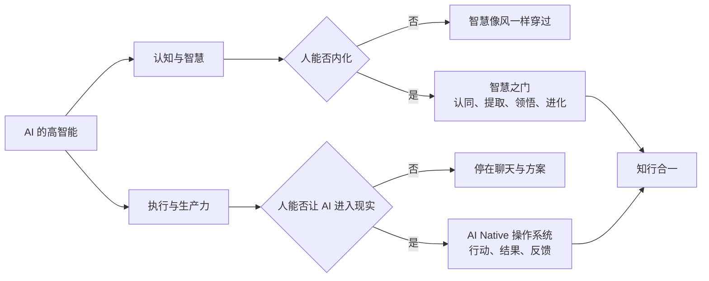

- **行动问题：** 如何让 AI 不只给建议，而是真正进入任务、项目和现实反馈？这是个人 AI Native 操作系统主要解决的问题。
- **内化问题：** 如何让 AI Chat、阅读、研究和真实讨论中出现的重要智慧，不只是看过，而是成为自己能够提取、理解、修正和使用的真知？这是智慧之门主要解决的问题。

两者最终不是两个系统，而是“知行合一”的两面。没有行动，认知只是漂亮文字；没有真知，行动只是被工具加速。

### 真知不是看过，而是发生了五次变化

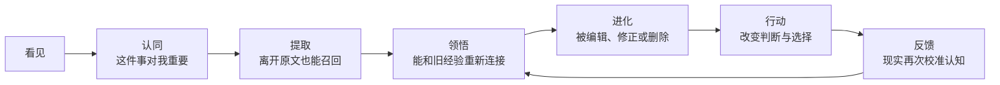

背下来还不够。死记硬背只是保存文字；真正的内化，是在没有原始对话的情况下主动提取，在新情境中重新理解，并愿意根据现实反馈修改它。

智慧之门已经形成了这样一套内核：

> 高价值认知被人选中 → AI 结构化 → 进入长期认知对象 → 按间隔主动召回 → 人复看、编辑、暂停或删除 → 周/月复盘重新审稿 → 确认后进入 Memory → 进入问题与行动 → 新反馈再回来

---

## 1. 现在的智慧之门到底已经有什么

### 1.1 实时证据快照

以下数据来自 2026-08-24 对飞书「智慧之门」表、配置表和 Workflow 的实时只读回读，不是本地文档推断。

| 证据 | 当前状态 | 它说明什么 |
| --- | ---: | --- |
| 认知对象 | **54 条** | 已经不是概念原型，而是持续积累的个人认知资产 |
| 字段 | **21 个** | 同时保存认知内容、来源、时效性、回顾状态与生命周期 |
| 认知层级 | 道 28、法 24、术 2 | 主要沉淀底层判断与方法，而不是工具说明 |
| 智慧时效性 | 中期 9、长期 23、永恒 22 | 45/54 被判断为需要长期或持续回顾 |
| 回顾运行状态 | 进行中 20、显式待首推 1、空 33 | 已有 20 条进入周期；空值在运行时按待首推处理 |
| 人工复看状态 | 已复看 7、空 47 | 人工复看字段已有真实使用，但全量维护仍处于早期 |
| 当前回顾配置 | 每日 2–3 张；历史补课上限 3 | 注意力预算是有限的，不追求一次推完 |
| 定时 Workflow | **enabled** | 当前仍按每日 09:00 触发 |

有三个事实需要特别说明：

1. `回顾状态` 为空不等于丢失。当前代码会把空值映射为“待首推”，再受系统启用日期、历史补课上限和四来源共享配额约束。
2. 20 条“进行中”证明回顾引擎已经在运行；但 33 条空状态也说明历史认知仍在渐进接入，不能声称 54 条全部完成了同等强度的回顾。
3. 这些数字只能证明系统和内容真实存在，不能直接证明 54 条都已被真正内化。

### 1.2 一条智慧不是一张图，而是一个有生命周期的认知对象

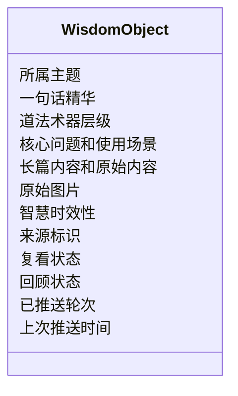

这些字段分别回答四类问题：

- **这是什么：** 主题、精华、层级。
- **它有什么用：** 核心问题和使用场景。
- **它从哪里来：** 原始内容、图片和来源标识。
- **它以后怎么办：** 时效性、复看状态、回顾状态、轮次和时间。

普通收藏只回答“我存了什么”。智慧之门还要回答“为什么值得记、什么时候再见、现在是否仍然成立、要不要继续留着”。

---

## 2. 现在有哪些领域和内容，它们解决了我什么问题

智慧之门没有单独的“领域”分类字段。下面是依据全部 54 条记录的标题、一句话精华和使用场景做的**人工多标签归纳**；一条认知可以同时属于多个领域。这是研究归纳，不冒充 Base 原生分类。代表标题以 Base 当前值为准；唯一含对谈对象称呼的标题在本文中做了脱敏。

### 2.1 人生哲学、主体性与生命秩序

代表内容包括《人何以自处》《从正确到自在》《心安：不是堡垒不倒，而是我能重新安顿》《君子不器》《我究竟愿意把这一生交给什么？》《Gap 一年：我真正完成了什么？》。

它们解决的不是知识问题，而是长期校准问题：

- 在机会、工具和外部评价越来越强时，怎样不丢失主体性；
- 如何处理自由、责任、意义、身份和变化；
- 怎样判断一件事是在滋养生命，还是让系统反过来占有自己；
- 外部秩序变化后，如何重新安顿并拥有自己。

### 2.2 AI 时代、组织与技术社会

代表内容包括《AI时代的根问题》《AI时代，生产关系将如何变化？》《AINative组织的本质：知行进化系统》《AI时代的反馈生态》《AI Coach总览》。

它们帮助我持续追问：

- AI 变强后，真正稀缺的是什么；
- 人、AI、数据、责任和反馈应该如何重新组合；
- 为什么 AI 加速不等于个人或组织进化；
- 怎样避免把系统搭建和真实进展混为一谈；
- AI 应该增强人的主体性，还是把人进一步客体化。

### 2.3 学习、人的成长与培养

代表内容包括《认知驱动》《从第一性原理理解阳明心学》《教育的本质：让人获得自主生长的能力》《AI时代教育的底层重构》《从撑伞到成为伞》。

它们解决的是“一个人怎样真正长出来”：

- 为什么知道正确答案仍然做不到；
- 如何从外部压力转为内部认同和主动创造；
- 如何让人获得自主生长，而不是依赖答案和权威；
- 帮助别人时，怎样避免替对方活、透支自己或制造依赖。

### 2.4 阅读、哲学、历史与跨学科研究

代表内容包括《中国哲学简史》《悉达多》相关认知、《吴军数学通识讲义》核心内容图、《像人类学家一样思考》《谁在改变历史？》《云南历史：山地枢纽，多元共生》。

它们把读过的书和做过的研究，从“知道作者说了什么”转成可复用的观察框架：

- 如何理解入世与出世；
- 如何面对权威并长出自己的法则；
- 如何把现实压缩成可推理结构；
- 如何把人的行为放回历史、关系和系统中理解；
- 如何从单一规律解释走向多层文明演化。

### 2.5 关系、助人和共同创造

代表内容包括《助有缘人：缘、需、能、行》《从一个人的世界，到与有缘人共赴星海》《从撑伞到成为伞》《生命共振》《AI 时代的反馈生态》。

它们帮助我形成关系和助人的边界：

- 什么样的人和关系值得进入；
- 怎样区分帮助、控制、拯救和共同创造；
- 如何把真实反馈带回个人成长；
- 怎样既不封闭自己，也不被关系耗尽。

### 2.6 投资、风险与价值判断

代表内容包括《投资哲学和读书：与他人的聊天》（标题脱敏）、《AI时代投资：变与不变》。

它们解决的是技术剧变中的判断稳定性：

- 区分好技术、好公司和好价格；
- 把风险、纪律、现金流和人性重新放回投资；
- 让投资服务生活与自由，而不是成为新的身份牢笼。

### 2.7 创作、诗性与真实生活

代表内容包括《玉溪云似海》《一个人的黄州》《无所思》《圆桌核心图：在命运、关系、时代与有限生命之间，如何安顿自己》。

它们提醒我：学习不能只剩分析和系统。诗、地方、身体、朋友、创作和真实生活，也是判断力与生命力的来源。

### 2.8 从内容分布可以得到什么结论

- **事实：** 54 条中有 28 条“道”、24 条“法”，内容重心明显是人生底层判断和可复用方法。
- **事实：** 内容横跨现实生活、AI 对话、读书研究、语音讨论、关系、投资、创作与自我反思。
- **推断：** 智慧之门不是按学科建立的百科，而是在围绕一个核心问题积累：AI 时代，我如何成为一个更清醒、更有主体性、能行动也能生活的人。
- **未知：** 目前没有原生领域标签，上述七类是人工多标签归纳；若以后需要长期统计，才值得新增明确分类，当前不为展示而改 Base。

---

## 3. 这些智慧是怎样生成的

### 3.1 真实起点不是“我要收藏”，而是一次高质量认知发生了

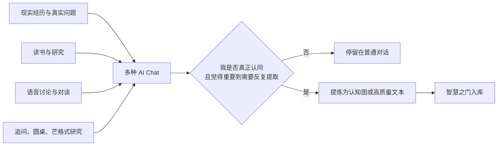

AI Chat 的形态并不单一，包括：

- 围绕一个真实问题连续提问与追问；
- 对一本书、一段经历或一个现实冲突做深度研究；
- 使用芒格式多元思维模型重新审视材料；
- 让不同思想视角进行圆桌式对话；
- 从 Voice-X 等语音讨论中提取有价值的认知；
- 把阅读、现实聊天和个人补充理解重新组合。

最重要的门槛不是 AI 生成，而是人的价值判断：**不是所有好内容都进入智慧之门，只有我已经认同、认为会长期影响判断、值得以后主动提取的内容才进入。**

### 3.2 入库时 AI 做什么，人做什么

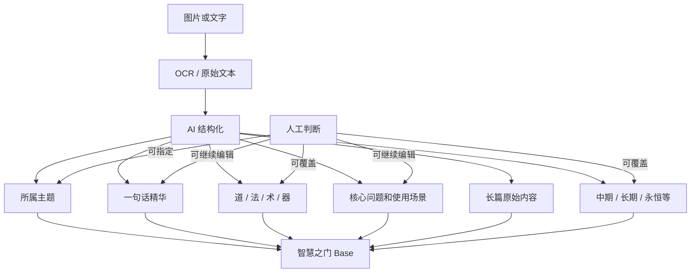

当前实现中的关键边界：

- 图片的原始附件保留，AI 提炼不能替代原始证据。
- 标题优先使用内容原题，不应任意重命名。
- 用户指定的层级和时效性优先于 AI 判断。
- 外部导入用稳定来源标识去重，缺失来源键时失败关闭。
- 同主题内容不会默认新建一条平行记录。

### 3.3 README 中此前缺失的真实背景

现有代码能说明“怎样入库”，但此前没有充分说明“为什么会生成这些图”。真正的生成逻辑是：

> 现实、阅读、语音或研究先提出问题；AI Chat 经过追问产生高质量智慧；人先判断并认同它；再把它提炼成可复看的图或文本；智慧之门负责让这段认知不从生命中再次消失。

这段背景应成为 Research-X README 的系统说明，而不是只留在个人口述中。

---

## 4. 智慧之门真正解决的问题：从经过智慧到拥有智慧

### 4.1 “看过”为什么不等于“知道”

AI Chat 的顺滑感很容易制造学习幻觉：在对话当下，每句话都能理解，于是以为自己已经掌握。但一旦离开原文：

- 不能主动说出核心判断；
- 不知道它适用于什么场景；
- 遇到相似问题时想不起来；
- 说得出金句，却无法改变选择；
- 新证据出现后，也不知道该修正哪一部分。

这意味着它只是经过工作记忆，还没有成为自己的认知结构。

### 4.2 智慧之门不是让人背答案，而是训练主动提取

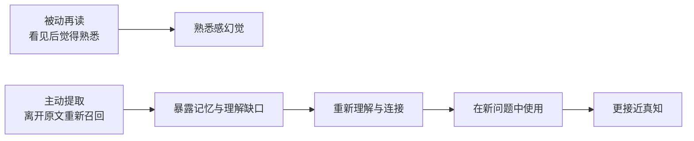

艾宾浩斯式间隔回顾的价值，不在于复刻一条完美科学曲线，而在于把重要认知从“偶然再次看到”变成“系统主动召回”。当前实时配置为：

| 时效性 | 回顾间隔 |
| --- | --- |
| 短期 | 1、7 天 |
| 中期 | 1、7、30 天 |
| 长期 | 1、3、7、14、30、60 天 |
| 永恒 | 完成前置周期后，每 60 天继续回顾 |

每日只安排 2–3 张，意味着系统的目标不是刷完，而是让注意力有能力真正停留。

### 4.3 当前定时链路已经真实运行

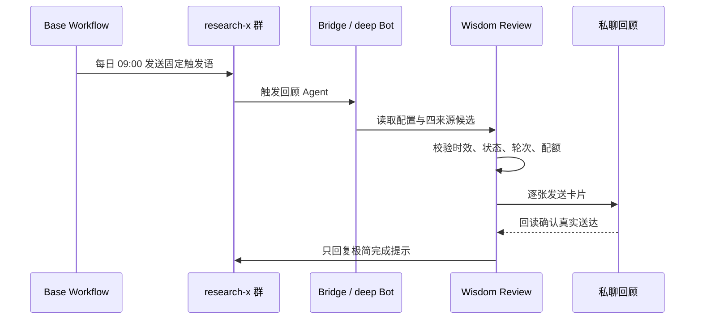

2026-08-24 实时回读确认：Workflow 状态为 `enabled`，触发规则为 `DAILY`，起始时间为 2026-07-18 09:00；当前配置每日下限 2、上限 3、历史补课上限 3。

---

## 5. 同一认知是否在逐步进化

答案是：**已经存在真实进化，但目前是“人主导的部分进化”，还不是全自动、完整版本化的认知演化系统。**

### 5.1 已被证据支持的三种进化

#### 第一种：同主题继续追加材料

本地运行记录在 2026-07-13 至 2026-08-24 期间记录了 36 次新建和 3 次对已有同主题记录追加附件，涉及《从撑伞到成为伞》《谁在改变历史？》《AI 时代的根问题》。这证明新材料可以回到同一认知对象，而不是一定生成重复卡片。

#### 第二种：人工修改核心表达

实时 Base 历史抽样显示，《心安：不是堡垒不倒，而是我能重新安顿》创建后，“一句话精华”发生过 3 次编辑。这不是轮次推进造成的机器状态变化，而是同一认知的核心表达被人反复修正。

#### 第三种：重新判断认知层级

《谁在改变历史？》的记录历史中，除图片追加和回顾轮次外，还发生过一次“层级”字段更新。这说明系统允许人重新判断一条认知究竟属于道、法、术还是器。

### 5.2 必须如实写出的实现边界

当前 `wisdom-gate` 入库脚本发现同主题时，会复用已有记录、去重后追加新附件，但**不会自动覆盖**原有的一句话精华、核心问题、长篇内容和时效性。

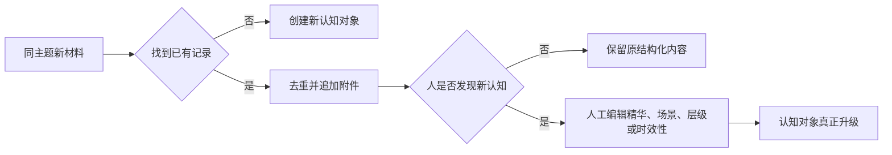

因此，当前最准确的成熟度判断是：

- **事实：** 已支持同主题合并、人工编辑、层级修正和附件追加。
- **事实：** 已有至少一条记录的核心精华发生多次人工修改。
- **推断：** 回顾过程中发现旧表达不准确，可以通过人工编辑完成认知进化。
- **未知/待验证：** 目前没有统一记录“为什么改、旧判断是什么、新证据是什么”的认知版本链。
- **非事实：** 不能声称每次回顾都会自动生成更高版本，也不能把回顾轮次增长当作认知质量增长。

---

## 6. 维护和删除：真正的学习系统必须允许遗忘

如果智慧之门只能增加内容，它最终仍会变成一个越来越重的柜子。认知系统必须拥有遗忘、暂停、修正和删除能力。

### 6.1 两套状态承担不同职责

| 状态 | 选项 | 用途 |
| --- | --- | --- |
| 人工复看状态 | 已复看、已过时、可升级、可删除 | 表达人对认知质量和生命周期的判断 |
| 自动回顾状态 | 待首推、进行中、已完成、暂停 | 控制定时调度和回顾轮次 |

回顾引擎会跳过人工标为“已过时”或“可删除”的记录，以及自动状态为“暂停”或“已完成”的记录。这意味着“我认为它不再值得反复进入注意力”可以直接改变系统行为。

### 6.2 周日减法链路

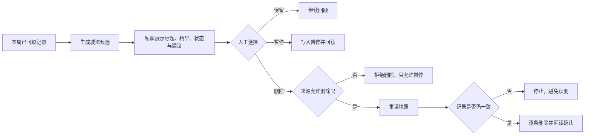

真实规则包括：

- 周日先完成正常回顾和送达回读，再生成减法候选；
- 建议每周删除至少 2 条，但不是强制指标，也不会自动删除；
- 用户可永久删除，也可只暂停后续回顾；
- 执行前重读身份、标题、精华、时间和动作能力；
- 每条执行后回读，任一失败立即停止；
- Flomo 镜像不能冒充删除原始笔记，因此只允许暂停；
- 详细候选只发私聊，群内不暴露私人认知内容。

### 6.3 当前维护成熟度

- **事实：** 删除、暂停、快照校验、逐条回读和来源能力边界已经写入代码与测试。
- **事实：** 41 项回顾测试覆盖删除失败、回读失败、并发变化、只读来源、Flomo 镜像和 dry-run 无写入。
- **事实：** 当前实时记录中，人工复看状态只有 7 条“已复看”，其余 47 条为空；没有记录处于“可删除”或“可升级”。
- **推断：** 维护机制已经具备，但“定期审视内容质量并编辑/淘汰”还没有像每日回顾一样形成同等稳定的使用密度。
- **未知：** 周日减法实际长期删除了多少低价值认知，目前没有独立统计证据。

---

## 7. 智慧之门与 Learn-X：内化和行动怎样重新合一

智慧之门解决“真知”的形成，个人 AI Native 操作系统解决“真实行动”，Learn-X 把两者放进同一个周期中审稿。

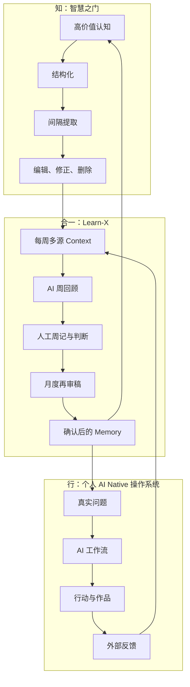

### 7.1 智慧之门怎样进入周回顾

Learn-X 每周只采集智慧之门中“本周新创建”的记录：

- 不是按最后更新时间；
- 不把旧记录的回顾轮次推进当作新学习；
- 保留主题、精华、问题、场景、层级和时效性；
- 长篇内容只做约 200–500 字的高信号压缩，原文仍留在 Base；
- 采集结果写入 `ready / empty / failed / unavailable` 来源状态。

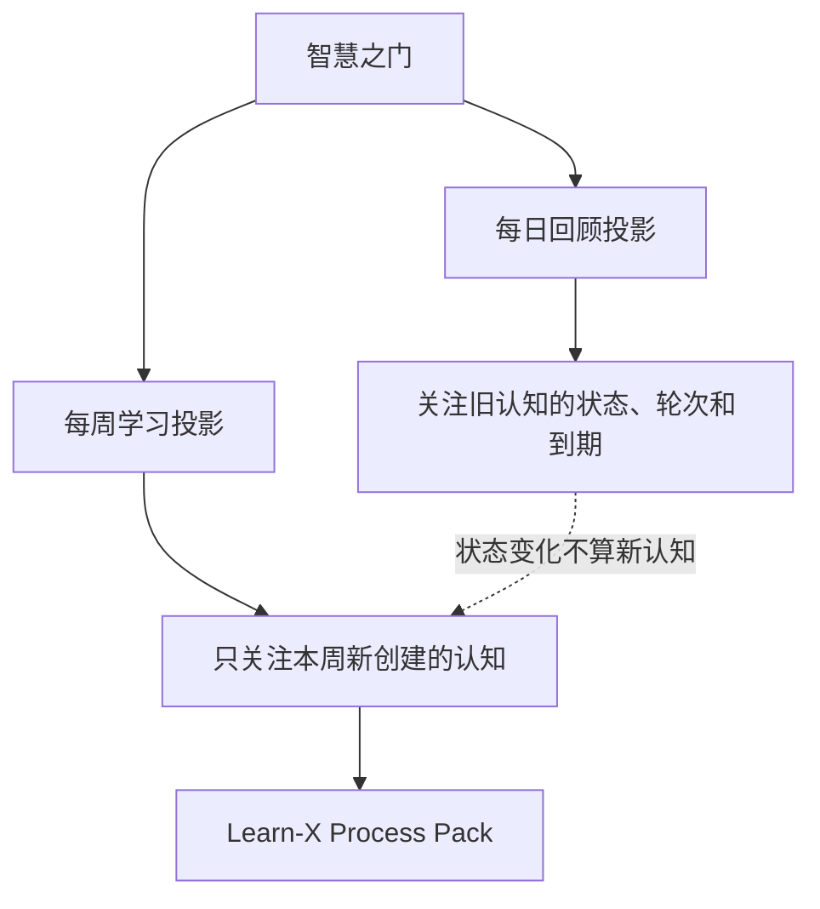

2026-W34 本地来源状态显示，智慧之门当周有 4 条新增记录并标记为 `ready`。同一周也存在其他来源 `empty` 或 `unavailable`，旧文件没有被用来伪装本周成功。

### 7.2 周记和月记的职责不是总结，而是审稿

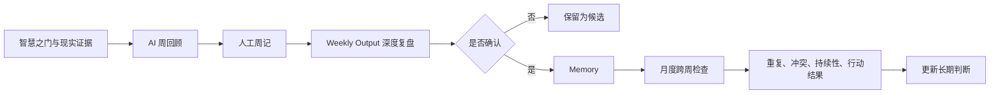

- 智慧之门回答：“这段认知值得再次进入注意力吗？”
- 周回顾回答：“它和这一周发生的真实事情有什么关系？”
- 月回顾回答：“跨越几周以后，它仍然成立吗？有没有冲突或修正？”
- Memory 回答：“哪些内容已经获得人工确认，值得影响未来问题与行动？”

### 7.3 Memory 怎样重新进入行动

当前 YW Next 只读取 Learn-X Memory，不直接读取智慧之门、周记、日记、阅读或 AI Coach 原文。

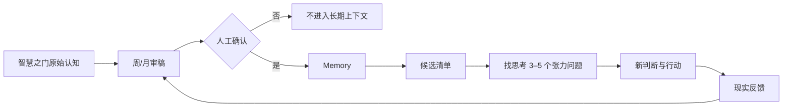

这个边界很重要：智慧之门中的内容虽然被我认同过，但仍不能绕过周期审稿直接获得长期解释权。

---

## 8. 当前系统能证明什么，不能证明什么

### 8.1 已被事实支持

1. **不是空系统。** 当前有 54 条真实认知对象，覆盖多类重要问题。
2. **不是普通收藏。** 每条记录包含问题、场景、时效性、状态和回顾轮次。
3. **不是只进不出。** 已有编辑、暂停、删除建议、永久删除和来源能力边界。
4. **不是手动想起才复习。** Workflow 当前启用，每日 09:00 自动触发。
5. **不是所有内容同等对待。** 道法术层级、时效性和共享注意力预算共同决定生命周期。
6. **不是 AI 自动写入长期信念。** 周/月回顾和 Memory 仍有人类确认门禁。
7. **认知确实发生过修正。** 实时历史样本存在一句话精华的多次人工编辑和层级调整。

### 8.2 当前只能算部分闭环

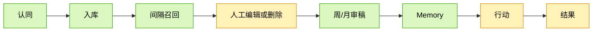

- 认知入库、定时召回、周期审稿和长期 Memory 已有真实运行证据。
- 人工内容升级与减法机制已经存在，但使用密度不及入库和回顾稳定。
- 某条具体智慧最终改变了哪次判断和行动，目前缺少统一关联键，仍需按案例核验。

### 8.3 不能过度声称

- 消息送达不等于真正理解。
- 回顾轮次增加不等于认知质量提高。
- Memory 写入不等于现实已证明它正确。
- 同主题追加图片不等于结构化内容已经更新。
- AI 写得像真理，不等于它已成为我的真知。

---

## 9. 最核心的研究结论

AI 时代，个体面对的真正问题不再只是“去哪里获得高质量知识”。AI 已经能在很多认知任务上超过绝大多数普通人，甚至能够模拟多位天才、思想家和专家一起帮助思考。

新的瓶颈是：

1. 人能否提出真实问题；
2. 人能否识别什么值得认同；
3. 人能否在没有原文时主动提取；
4. 人能否把新认知和旧经验连接起来；
5. 人能否根据现实继续编辑和淘汰；
6. 人能否让认知进入行动，并承担反馈。

因此，智慧之门最重要的意义不是保存 AI 的答案，而是增强人的“认知承载能力”。

> AI Native 操作系统让 AI 进入现实行动；智慧之门让 AI 的智慧进入人的认知结构；Learn-X 让知与行在周期反馈中一起进化。

这才是完整的 AI Native 自我学习系统：不是让 AI 替我知道，也不是让 AI 替我行动，而是借助 AI，让我获得更接近真知的能力，并用现实不断检验它。

---

## 10. 15 分钟分享路径

### 0–3 分钟：先讲矛盾，不先讲系统

- AI 的智慧像一阵风：经过了人，却没有被人拥有。
- AI 对个人有两个瓶颈：行动与内化。
- 个人 AI Native 操作系统解决行动；智慧之门解决内化；终点是知行合一。

### 3–7 分钟：展示现在真实有什么

- 实时展示 54 条认知对象、21 个字段、道法术分布和时效性分布。
- 展示七类真实内容及各自解决的问题。
- 只展示标题、精华、场景和统计，不展示原始聊天、私人附件或身份信息。

### 7–10 分钟：一条智慧如何从 Chat 进入内化

- 真实问题、读书、语音或研究 → 多轮 AI Chat → 人判断重要 → 认知图 → 结构化入库。
- 展示每日 09:00、当前 2–3 张、差异化间隔和私聊回读。
- 强调目标不是再读，而是主动提取。

### 10–12 分钟：进化和删除

- 展示一条精华发生 3 次人工编辑的历史证据。
- 说明同主题当前只自动追加附件，结构化升级仍由人决定。
- 展示周日减法、暂停、删除、快照和回读逻辑。

### 12–15 分钟：回到知行合一

- 智慧之门进入 Learn-X 周/月审稿，再经人工确认进入 Memory。
- Memory 重新进入“找思考”和现实行动。
- 以边界收尾：系统已经证明“可持续承载智慧”，但“哪条认知改变了哪个行动”仍需继续用真实案例验证。

现场只做只读展示，不执行回顾发送、删除、暂停或其他外部写入；动态系统不可用时使用本文证据与图示。

---

## 11. 证据索引与验证结果

### 飞书实时证据

- Base：`W6NLbDh1YahvZ9sbjIccEirBnae`
- 智慧之门表：`tblMGGWdVH4Iq9Og`
- 回顾配置表：`tblbGM0BDHQ1ONcj`
- 每日回顾 Workflow：`wkfnjd2gE3n26owm`
- 2026-08-24 实时回读：54 条记录、21 个字段、Workflow `enabled`、每日 09:00、当前每日 2–3 张。
- 记录历史抽样只输出变更字段名与时间，不读取或展示私人原文。

### 本地实现证据

- `/Users/yuwei/code/research-x/README.md`
- `/Users/yuwei/code/research-x/AGENTS.md`
- `/Users/yuwei/code/research-x/.agents/skills/wisdom-gate/SKILL.md`
- `/Users/yuwei/code/research-x/.agents/skills/wisdom-gate/scripts/ingest.mjs`
- `/Users/yuwei/code/research-x/.agents/skills/wisdom-review/SKILL.md`
- `/Users/yuwei/code/research-x/.agents/skills/wisdom-review/scripts/run-review.mjs`
- `/Users/yuwei/code/learn-x/.agents/skills/learn-x-weekly-automation/SKILL.md`
- `/Users/yuwei/code/learn-x/.agents/skills/learn-x-process/SKILL.md`
- `/Users/yuwei/.codex/skills/learn-x-input/SKILL.md`
- `/Users/yuwei/.codex/skills/ywnext/SKILL.md`

### 测试证据

- Wisdom Gate / Wisdom Review：41/41 通过。
- Learn-X 智慧采集、周/月处理与 Memory 边界：26/26 通过。
- YW Next Memory-only 边界：4/4 通过。
- 合计：71/71 通过。

### 本次边界

- 所有飞书操作均为只读，没有发送消息、推进轮次、编辑、暂停或删除记录。
- 文档没有展示原始聊天、附件、身份信息或私人长篇内容。
- 领域归纳属于基于真实字段的研究推断；数量、层级、时效性、状态和 Workflow 属于实时事实。
