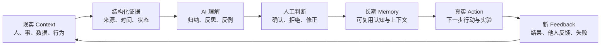
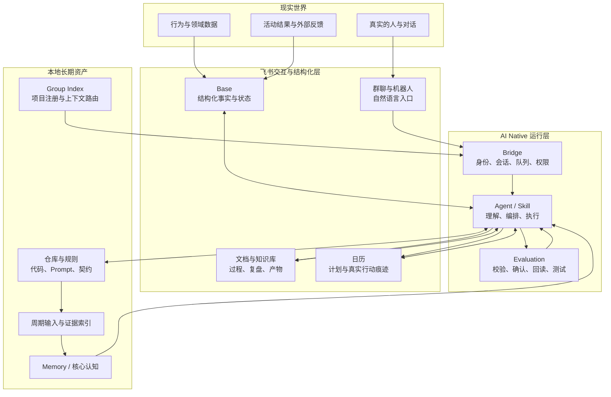
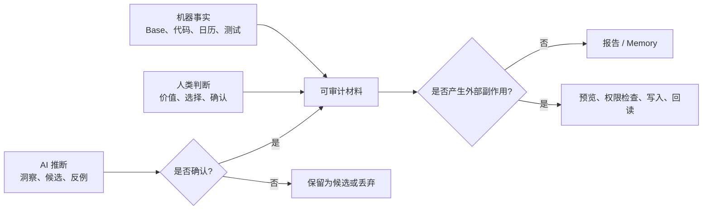
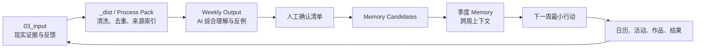
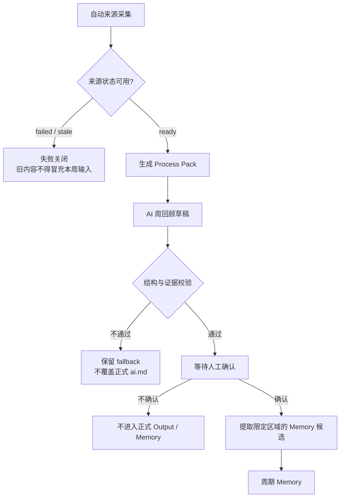
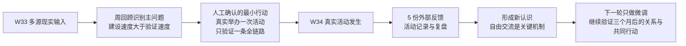
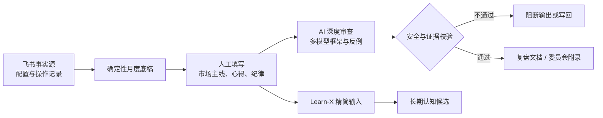
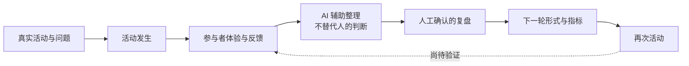
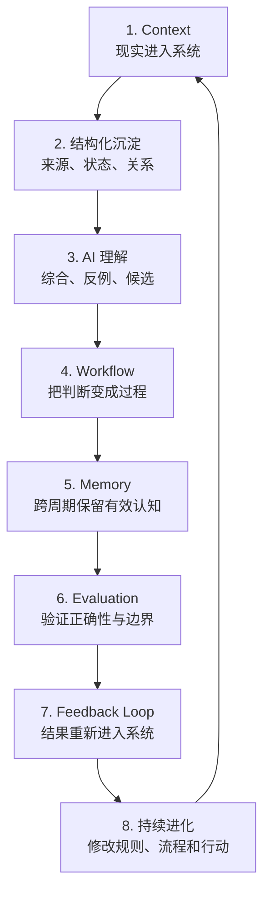

# 从个人 AI Native 操作系统到 AI Native 组织

> 一份基于真实系统、真实运行与真实反馈的研究

## 一页结论

过去两三个月，我投入最多的并不是某一个 AI 应用，而是一套以自己为首个用户、持续运行的 **AI Native 个人操作系统**。

它的核心不是“让 AI 帮我做更多事”，而是让系统持续完成一轮认知与行动迭代：

这套系统最重要的价值，不是积累了多少工具，而是已经形成了一个可重复运行的学习回路：现实进入系统，AI 帮助理解，人保留最终判断权，判断改变行动，行动再产生新的现实证据。

这也是我对 AI Native 组织的核心理解：

> AI Native 组织不是“一个大量使用 AI 的组织”，而是一个能持续获取现实、形成判断、改变行动，并用反馈校准自己的组织学习系统。

个人系统不是组织系统的缩小 UI，但可以成为它的核心实验室。个人尺度的优势是责任单一、反馈快、迭代频率高；组织尺度真正新增的是多人之间的身份、权限、责任、冲突、治理与协作成本。

### 已经被事实支持的判断

- **事实：** Learn-X 已形成从多源输入、周度处理、AI 周回顾、人工确认、季度 Memory 到下一步行动的完整结构；本地可见 W22–W33 的连续周输入、周输出与处理包。
- **事实：** 2026-W33 的周回顾提出“真正举办一次读书会”和“只验证一条真实全链路”；下一周真实活动发生，随后收集了 5 份反馈并形成复盘与后续实验。
- **事实：** Invest-X 已把领域事实、人工判断、AI 审查、安全约束和 Learn-X 输入分开；真实 Base 中存在持续积累的操作与复盘记录。
- **事实：** 2026-08-10 至 2026-08-23 的本地会话元数据显示，Learn-X 与 Invest-X 的核心 Skill 均有高频调用记录，说明这些不是只写在文档中的设计。
- **推断：** 个人系统中验证过的“证据、判断、记忆、行动、反馈”机制，可以迁移为组织的认知与执行内核。
- **待验证：** 多人环境中的责任划分、权限隔离、分歧处理、组织级评测和长期服务稳定性，不能由个人系统的成功直接推出。

---

## 1. 我实际打造的不是工具集合，而是一套操作系统

### 1.1 系统全景

这套系统以飞书作为现实世界入口和协作界面，以本地仓库作为可审查、可测试的确定性层，以 Agent 与 Skill 作为认知和执行层。

这张图里，飞书不是简单的“前端”，本地代码也不是简单的“后端”：

- 飞书承载现实输入、结构化状态、协作界面和可见结果。
- 本地仓库承载规则、Prompt、测试、确定性处理和可版本化的长期资产。
- Agent 负责理解语义、调度流程和处理不确定性。
- Evaluation 决定 AI 的输出能否成为事实、长期记忆或真实副作用。

### 1.2 四种信息必须分开

系统能够长期进化的前提，不是 AI 更聪明，而是不同信息拥有清楚的真值归属。

| 信息类型 | 谁拥有最终解释权 | 当前系统中的处理方式 |
| --- | --- | --- |
| 机器事实 | 实际数据源 | 从 Base、代码、日历或测试读取，不靠模型补全 |
| 人类判断 | 人 | 人工填写、勾选或明确确认，AI 不替代价值判断 |
| AI 推断 | AI 提议、人审核 | 标为候选、反例或待确认内容，不直接进入长期真值 |
| 外部副作用 | 受权限约束的人与系统 | 写入前预览，写入后回读；失败时停止并保留恢复边界 |

### 1.3 两个支撑系统

**Group Index** 把项目定位、优先级等人工字段放在 Base，把可扫描的 Skill、仓库与数据源信息留给代码，并为不同群和仓库生成上下文。它解决的是“AI 此刻在哪个项目、应相信什么、能调用什么”。

**lark-channel-bridge** 把飞书消息变成本机 Agent run，再把结果写回原会话。它已经包含 scope、session、queue、工作目录、身份、权限策略和运行事件。它解决的是“自然语言请求如何可靠进入正确的 Agent 环境”。

这两者不是本次分享的独立案例，但构成了从个人工作流走向组织工作流所需的控制面雏形。

---

## 2. 主案例：Learn-X 每周认知迭代

### 2.1 为什么 Learn-X 是唯一主链路

Learn-X 不是知识库、日记库或 AI 摘要器。它明确把输入、判断、沉淀、行动和反馈放在同一条周期链路中：

本地可见的实际周期不是一次 Demo：

- 周输入目录覆盖 `2026-W22` 至 `2026-W34`，其中 W34 尚处于进行中。
- 正式周输出与处理包覆盖 W22–W33。
- 季度 Memory 已形成 `2026-Q2`、`2026-Q3` 两个周期文件。
- W33 的处理元数据记录了 13 个去重后的输入源，包括 AI、Build、日历、日记、健康、语音、阅读、对话和外部智慧输入。
- 相关输入、处理与周回顾测试于 2026-08-23 运行，81/81 通过。

### 2.2 这条链路如何防止“漂亮总结”冒充进化

关键不在于模型生成了多少洞察，而在于系统明确知道：

1. 哪些来源属于本周，哪些为空、失败或过期。
2. 哪些只是 AI 草稿，哪些已被人确认。
3. 哪些内容可以成为 Memory，哪些只能继续观察。
4. 哪些建议已经转化为行动，哪些仍只是语言。

### 2.3 一条已经发生的“认知 → 行动 → 反馈”链路

W33 是目前最适合脱敏展示的一周，因为它没有停在认知总结。

对应证据：

- **事实：** W33 周输出把“真正举办一次活动，而不是继续优化方案”列为第一项最小高价值行动，完成边界要求活动真实发生、至少获得 2–3 条参与者反馈，并形成继续、修改或停止的判断。
- **事实：** W33 同时要求系统建设只验证一条真实全链路，并明确“不要证明还能建设，证明已经建设的东西真的有用”。
- **事实：** Reading Club 仓库于 2026-08-17 初始化；2026-08-18 的真实活动随后进入 Base，并产生活动记录、总结和 5 份匿名反馈。
- **事实：** 复盘从反馈中识别出“自由交流和讨论最有价值”，下一轮不大改结构，只调整场地、节奏、问题表达并保留充分自由交流时间。
- **事实：** 新的长期 Evaluation 不再只看单场满意度，而是观察三个月后是否产生持续关系、继续交流或共同行动。

这条链路说明，Learn-X 的价值不只是“帮助我更了解自己”，而是把抽象认知压缩成一个可以在现实中失败的实验，再把外部反馈带回下一轮判断。

### 2.4 Skill 使用密度只是旁证

2026-08-10 至 2026-08-23 的本地 Codex 会话元数据受限统计如下。统计只包含 Skill 名、调用时间、耗时与退出状态，不包含对话正文；“调用”也不等于一次完整业务闭环。

| Learn-X Skill | 调用记录 | 活跃天数 | 记录到的失败 |
| --- | ---: | ---: | ---: |
| `learn-x-weekly-automation` | 113 | 10 | 0 |
| `learn-x-process` | 85 | 9 | 0 |
| `learn-x-input` | 49 | 8 | 0 |

它们能证明这套工作流被高频使用；真正证明系统有效的，仍然是周期产物、人工确认、现实行动和后续反馈。

---

## 3. 辅助案例：Invest-X 的专业判断与人机治理

Invest-X 展示的是另一种 AI Native 能力：面对高风险、强专业、容易被模型自信误导的领域，系统如何把“事实、外部分析、人工判断与行动边界”分开。

### 3.1 已有的真实证据

- **事实：** 真实 Base 中有 23 条资产配置记录、353 条操作记录和 4 条复盘记录；这里仅核验结构与数量，没有读取或展示金额与持仓。
- **事实：** 本地存在 2026-06 的月度底稿及对应 Learn-X 输入，说明“事实底稿 → 人工复盘 → Learn-X”的链路至少实际运行过。
- **事实：** 2026-08 的复盘产物包含独立的人工记录区与委员会审查区，并有成功写回的 revision 与 protected hash 回执。
- **事实：** Invest-X 测试于 2026-08-23 运行，53/53 通过，覆盖来源约束、概率与时间窗口、禁止交易指令、人工输入门禁、revision 冲突、受保护区哈希和部分失败等路径。

### 3.2 人机边界比“生成深度”更重要

| 机器负责 | 人负责 | 系统禁止 |
| --- | --- | --- |
| 读取事实、计算结构、整理周期变化 | 市场主线、投资心得、纪律与最终判断 | 预测式自信、具体买卖、仓位、金额和点位指令 |
| 核验外部证据与时间窗口 | 决定是否认可 AI 观察 | 用操作次数自动推断纪律 |
| 生成候选与反例 | 决定什么进入 Learn-X | 未确认判断进入长期记忆 |
| revision 检查、受保护区哈希、读回 | 确认外部写入 | 覆盖人工填写内容 |

### 3.3 当前成熟度

2026-08-10 至 2026-08-23 的元数据中，`asset-report`、`invest-event-watch`、`invest-review` 分别有 77、41、36 次调用记录，活跃于 5 天，未记录到失败。

但这仍只能证明使用和工程治理。**目前没有足够脱敏证据证明某一次复盘直接改变了后续真实投资行为并再次得到反馈**，因此 Invest-X 在本文中被定义为“专业决策与治理闭环”，而不是已完整验证的行为改变案例。

---

## 4. 早期案例：Reading Club 把系统带到外部用户世界

Reading Club 的价值不在于成熟，而在于它首次把个人系统中的“现实反馈”从自我反馈扩展到了真实参与者。

### 4.1 已发生什么

截至 2026-08-23 的只读核验结果：

- Base 只有三张业务表：1 条真实活动、5 条活动反馈、2 条读书会思考。
- 活动记录已挂接文字记录与复盘沉淀。
- 5 份反馈均在活动结束后提交；本文不读取姓名或文字反馈原文。
- 复盘已经把反馈转为下一轮的小步实验，而不是立即重建活动系统。
- 图片思考入库 Skill 已实现“读取真实字段 → 结构化预览 → 人工确认 → 查重 → 写入 → 附件回读”的契约。

### 4.2 为什么仍然只能叫早期案例

- 目前只有一场活动，无法证明机制可以跨主题、参与者与周期稳定重复。
- 文档中的活动阶段流程尚未完整映射为当前 Base 字段，说明 schema 仍在早期校准。
- `reading-club-thinking` 尚未进入本次 14 天调用榜，不能声称已形成高频使用。
- 长期指标被定义为三个月后的持续关系与共同行动，当前时间尚不足以验证。

因此，准确表述是：

> 首轮“活动 → 反馈 → 复盘 → 下一轮实验”已经发生；可重复性、长期关系和多人协作机制仍待后续周期验证。

这正是 AI Native 系统应有的成熟方式：先让现实发生，再根据反馈增加系统，而不是先用功能制造进展感。

---

## 5. 个人 AI Native 操作系统与 AI Native 组织的核心共性

个人与组织使用的工具可以不同，但真正可迁移的是下面八层运行机制。

| 迁移层 | 个人系统中的现有实践 | 放到组织中的含义 |
| --- | --- | --- |
| Context | 日记、日历、阅读、健康、投资、对话、活动反馈 | 客户、产品、运营、团队、市场与交付事实持续进入系统 |
| 结构化沉淀 | Base、周期目录、来源状态、哈希、项目索引 | 统一业务对象、关系、来源、时间与责任人 |
| AI 理解 | 周回顾、领域分析、反例、候选洞察 | Agent 针对角色和业务链形成可追溯理解 |
| Workflow | Skill、自动采集、人工确认、写入回读 | 将组织方法变成可执行、可观察的工作流 |
| Memory | 周/月/季度 Memory 与核心认知 | 团队、项目、客户和组织层级的长期上下文 |
| Evaluation | 测试、schema 校验、来源门禁、revision、protected hash | 质量标准、业务指标、权限测试、审计与红队机制 |
| Feedback Loop | 下一周行动、活动反馈、领域结果 | 用户行为、交付结果、团队反馈和商业结果回流 |
| 持续进化 | 根据真实失败修改 Prompt、规则、字段和行动 | 组织通过运行证据更新流程、产品和决策机制 |

最大的共性是：**AI 不只是回答问题，而是进入一个有现实输入、状态、记忆、评测和反馈的持续系统。**

---

## 6. 从个人操作系统到 AI Native 组织，真正新增了什么

个人系统的核心优势，是一个人同时拥有目标、Context、判断权和行动权。组织中这四者会被拆开，复杂度因此不是线性增加。

```mermaid
flowchart LR
    subgraph Personal[个人尺度]
        P1[单一身份]
        P2[单一目标函数]
        P3[同一人判断与行动]
        P4[短反馈链]
    end

    subgraph Delta[组织新增复杂度]
        D1[多人身份与权限]
        D2[目标冲突与责任归属]
        D3[版本、并发与交接]
        D4[治理、审计与隐私]
        D5[外部用户与服务承诺]
        D6[更长业务链与反馈延迟]
    end

    subgraph Organization[组织尺度目标]
        O1[共享但分层的 Context]
        O2[可追责的人机协作]
        O3[组织级 Memory 与 Evaluation]
        O4[跨角色持续进化]
    end

    Personal --> Delta --> Organization
```

### 6.1 八个核心区别

| 复杂度 | 个人尺度 | 组织尺度 | 当前基础与缺口 |
| --- | --- | --- | --- |
| 身份与权限 | 一个人拥有全部资源 | 不同角色只能看到和操作必要范围 | bridge 已有身份、scope 和访问策略；细粒度业务授权待验证 |
| 责任 | 判断与行动通常属于同一人 | AI 建议、审批、执行、结果必须可追责 | 已有人工确认门禁；尚无组织级 RACI 或责任契约 |
| 目标函数 | 个人可以直接做最终价值判断 | 不同角色、部门和用户目标可能冲突 | 已确认“人拥有最终目标函数”；冲突解决机制待设计 |
| Memory | 一套个人长期上下文 | 个人、团队、项目、客户、组织 Memory 必须分层 | 已有周期 Memory；跨角色隔离和遗忘策略待验证 |
| 并发与版本 | 大多串行 | 多人同时修改状态，存在冲突和重复副作用 | Invest-X 已有 revision/hash；组织级并发仍需扩展 |
| Evaluation | 本人判断是否有用 | 需要质量、业务、风险与用户价值的共同指标 | 已有测试与回读；组织级指标和责任人尚缺 |
| 外部用户 | 反馈主要回到本人 | 涉及同意、隐私、稳定性与服务承诺 | Reading Club 开始产生外部反馈；长期与规模尚未验证 |
| 反馈链 | 行动后很快得到结果 | 跨多角色和业务阶段，反馈可能延迟或失真 | Learn-X 已有周循环；长链路归因仍是未知项 |

### 6.2 最需要保留的个人系统经验

1. **先定义真值归属，再接入 AI。** AI 可以解释事实，但不能悄悄成为事实源。
2. **把确认点放在不可逆副作用之前。** 预览、权限、revision 和回读不是附加功能，而是组织信任的基础。
3. **Memory 不是保存所有内容。** 它是经过周期审稿、仍值得影响未来判断的少量上下文。
4. **Evaluation 不只是模型评分。** 来源是否完整、旧数据是否冒充新数据、人工内容是否被覆盖、写入是否真实落地，都属于评测。
5. **反馈必须能修改系统。** 如果结果只进入报告、不改变规则、流程或行动，就没有真正的学习回路。
6. **先跑真实最小闭环，再增加系统。** 个人实践中最有效的工程原则，同样适用于组织建设。

### 6.3 不能直接从个人经验推出的结论

- 个人高频使用不等于多人愿意持续使用。
- 一个人确认有效，不等于组织已经形成正确的责任与审批机制。
- 一次真实活动成功，不等于外部用户闭环可以稳定复制。
- 测试通过不等于业务价值成立；业务结果仍需独立 Evaluation。
- 飞书与 Agent 能承载个人系统，不代表现有配置已经满足组织级安全、稳定性和规模要求。

---

## 7. 15 分钟分享与演示路径

### 0–2 分钟：核心研究结论

展示“一页结论”和第一张闭环图，只讲三句话：

1. AI Native 的核心不是使用 AI，而是建立持续学习和行动的系统。
2. 我先以自己为高频迭代对象，已经把这套内核运行在真实生活与专业决策中。
3. 组织放大不是复制工具，而是为同一内核增加多人权限、责任、治理和更长反馈链。

### 2–8 分钟：Learn-X 真实周迭代

按“W33 输入元数据 → 周输出 → 人工确认 → Q3 Memory → W34 现实证据”依次展示。

现场安全互动：

> 读取 2026-W33 的来源清单、周输出和季度 Memory，只回答三件事：哪些是事实，哪条判断被人工确认，哪项行动在下一周留下了新证据。不要生成新建议，不展示私人原文。

静态兜底：使用本文第 2.3 节的时间链路图和证据列表。

### 8–12 分钟：Invest-X 的人机边界

只展示结构、测试和脱敏后的数量，不打开金额或持仓。

现场安全互动：

> 基于 Invest-X 的流程契约，解释机器负责什么、人负责什么、什么内容被禁止进入输出；仅使用 schema、测试和脱敏元数据。

静态兜底：使用第 3 节流程图与人机边界表。

### 12–15 分钟：Reading Club 与组织复杂度

展示“一场活动、五份反馈、一份复盘、下一轮实验”，随后切到个人与组织的八项差异。

现场安全互动：

> 只读活动时间、匿名反馈数量和复盘中的后续实验，总结证据如何改变下一轮设计。不要读取姓名和反馈正文，不执行写入。

静态兜底：使用第 4 节闭环图和第 6 节组织复杂度图。

所有现场操作保持只读或预览，不执行 Base、文档、日历或消息写入。

---

## 8. 证据索引与验证边界

### 本地证据

| 证据 | 路径或命令 | 支持的结论 |
| --- | --- | --- |
| Learn-X 系统定义 | `learn-x/README.md`、`03_input/README.md`、`04_output/README.md` | 输入、Output、Memory、Core 的职责与人机边界 |
| W33 输入审计 | `learn-x/04_output/_dist/weekly/2026-W33/input.json` | 13 个去重输入源及来源结构 |
| W33 周输出 | `learn-x/04_output/weekly/2026-33.md` | 真实行动、完成边界、人工确认清单 |
| 周度 Memory | `learn-x/04_output/_dist/weekly/2026-W33/memory-candidates.md`、`01_core/memory/2026-Q3.memory.md` | 周输出如何进入跨周上下文 |
| Learn-X 核心测试 | 2026-08-23：输入、处理、周回顾相关测试 81/81 通过 | 来源状态、失败关闭、人工确认与 Memory 提取契约 |
| Invest-X 产物 | `invest-x/outputs/2026-06-18.md`、`2026-06-18.learnx.md`、`2026-08-20.review.md` | 月度底稿、人工区、Learn-X 输入和委员会结构 |
| Invest-X 测试 | 2026-08-23：`npm test`，53/53 通过 | 安全、证据、revision、hash、失败路径 |
| 项目控制面 | `group-index/CODE_WIKI.md`、`lark-channel-bridge/docs/ARCHITECTURE.md` | 项目注册、身份、session、queue、权限与运行边界 |

完整 Learn-X 应用测试本轮为 91/97：6 项涉及当前沙箱禁止写入 `dist` 或仓库测试临时目录，未作为本文核心链路的通过证据；核心输入、处理和周回顾测试已单独运行并全部通过。

### 飞书只读证据

| 证据 | 2026-08-23 只读结果 | 隐私边界 |
| --- | --- | --- |
| Reading Club Base | 1 场活动、5 份反馈、2 条思考 | 未读取姓名或反馈正文 |
| Reading Club 活动记录 | 有活动文字记录、复盘与后续实验 | 只提取机制与下一步，不展示参与者信息 |
| Invest-X Base | 23 条配置、353 条操作、4 条复盘 | 未读取金额、持仓或操作内容 |
| Invest-X 复盘索引 | 2024、2025、2026 均有复盘文档记录 | 只核验日期和链接存在 |

### Skill 使用统计口径

- 统计窗口：2026-08-10 至 2026-08-23（含首尾日期）。
- 数据范围：本地 Codex 会话中的 Skill 名、时间戳、耗时与退出状态。
- 不读取或保存对话正文、原始命令参数和日志正文。
- 调用次数用于说明使用密度，不用于证明完整业务结果或产出质量。

### 最终边界

目前可以有把握地说：**个人尺度的 AI Native 认知—行动内核已经持续运行，并至少出现了一条可追溯的现实反馈闭环。**

目前还不能说：**这套系统已经完成组织级验证。** 下一阶段真正要验证的不是更多功能，而是多人身份、责任、长期 Memory、组织级 Evaluation 和跨角色反馈链能否稳定成立。

这不是系统的缺陷，而是从个人实验室走向组织实践时最重要、也最诚实的边界。
